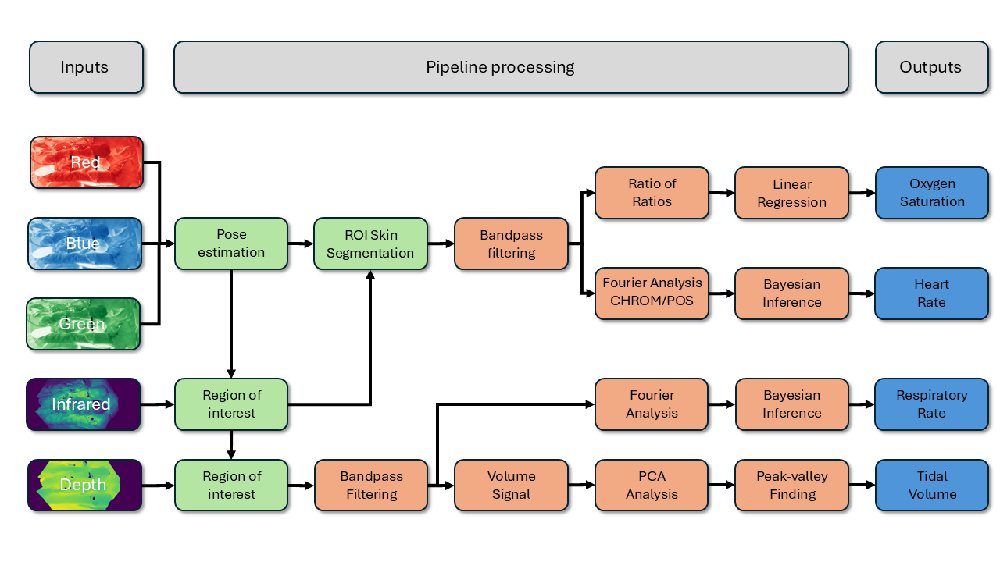

# Meerkat Vital Sign Monitoring

## Abstract
This pipeline processes RGB-D data to estimate vital signs of neonates in intensive care units. It aims to streamline non-contact monitoring, making it easier to analyze signals for research or clinical use.

## Description
Pipeline elements can be run directly from `main.ipynb`. The dataset is structured so that each patient’s data is contained in its own folder. When executing the pipeline, a subject is chosen from the list of available subjects. Empty folders indicate unavailable or invalid signals.

## Pipeline Overview



## Getting Started

* Dataset can be downloaded from Apollo: [https://doi.org/10.17863/CAM.111417](https://doi.org/10.17863/CAM.111417)  
* Update `main.ipynb` with the local path for your dataset  

### Dependencies
* Python (version 3.11.5)
* NumPy (version 1.25.2)
* SciPy (version 1.11.2)
* scikit-learn (version 1.3.1)
* simdkalman (1.0.4)
* ventiliser (version 1.0.0)
* Matplotlib (version 3.8.0)
* seaborn (version 0.13.0)
* pandas (version 1.5.3)

## Environment Setup

To activate the virtual environment (Windows PowerShell):
```powershell
.\venv\Scripts\Activate.ps1
```

For Command Prompt (cmd.exe):
```cmd
.\venv\Scripts\activate.bat
```

## Running the Analysis
1. Launch the environment as shown above  
2. Open `main.ipynb` in Jupyter or VS Code  
3. Run the notebook cells to process individual subject data

## Authors

Silas Ruhrberg Estevez  
sr933@cam.ac.uk

## License

This project is licensed under the CC-BY License  
Please cite our publication when using the dataset or code:  
@article{RuhrbergEstvez2025,  
  title = {Continuous non-contact vital sign monitoring of neonates in intensive care units using RGB-D cameras},  
  volume = {15},  
  ISSN = {2045-2322},  
  url = {http://dx.doi.org/10.1038/s41598-025-00539-9},  
  DOI = {10.1038/s41598-025-00539-9},  
  number = {1},  
  journal = {Scientific Reports},  
  publisher = {Springer Science and Business Media LLC},  
  author = {Ruhrberg Estévez,  Silas and Grafton,  Alex and Thomson,  Lynn and Warnecke,  Joana and Beardsall,  Kathryn and Lasenby,  Joan},  
  year = {2025},  
  month = may  
}

## Acknowledgments
* Alex Grafton, Lynn Thomson, Kathryn Beardsall, Joana Warnecke, and Joan Lasenby
* Rosetrees Trust for funding the clinical study


